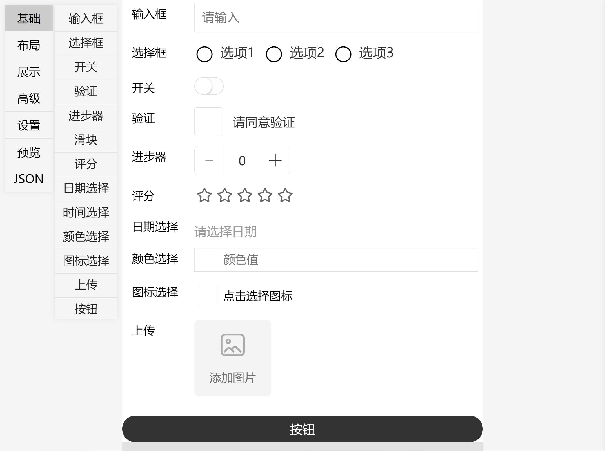

# Taro表单编辑器
基于Taro3和react-dnd组件开发的表单编辑器，将支持多个平台（小程序、h5、app）目前仍在开发中，暂时兼容h5端，因接口限制，编辑模式仅支持在h5端。
## 预览版
当前版本任处于开发阶段，可能存在api改版或者bug修复导致的不兼容问题，请谨慎用于项目中。
## 在线预览
- 表单预览：
http://form.t.platelet.xyz/
- 编辑模式：
http://form.t.platelet.xyz/#/main/edit/index
## 截图

# TaroForm交流群
 + qq群：816711392
 + 
# 使用
+ h5端：
将代码克隆到本地，执行 `yarn` 或者 `npm install` ，安装依赖，然后执行 `yarn dev:h5` 或者 `npm run dev:h5` 启动h5版本，跳转到`main/edit/index`页面即可进入编辑模式
+ 小程序端： 
将代码克隆到本地，执行 `yarn` 或者 `npm install` ，安装依赖，然后执行 `yarn dev:weapp` 或者 `npm run dev:weapp` 启动微信小程序版本，微信小程序仅支持表单查看页面
+ RN端暂未调试，目前不兼容

# 组件支持
## 基本组件
- input 输入框
- input 多行文本输入
- select 单选
- select 多选
- select 下拉单选
- select 下拉多选
- sitch 开关
- check 验证开关
- steep 进步器
- slider 拖动条
- rate 评分
- date 日期
- time 时间
- button 按钮
- update 图片和视频上传
- update 文件上传
- color 颜色选择
- icon-select 图标选择
- area 省市区地区选择 待实现
- picker 多列选择器  待实现
- picker 多列关联选择器  待实现
- period 时间段选择 待实现
## 展示组件
- text 文本组件
- image 图片组件
- icon 图标组件
- segment 分割线组件
## 布局组件
- felx 栅格（flex）布局
- tab tab布局
- row 横向布局
- column 竖向布局
- panel 面板布局
- compose 分组（将多个表单放在一起 默认显示一个 可以点击展开）
- background 背景（有背景图的容器）
- page 分页组件 待实现
## 高级组件
- object 对象表单
- array 数组表单
- array-one 一维数组（填写表单时增减表单）
- array-two 二维数组（填写表单时增减表单）
## 营销组件
- spec 商品规格编辑器  待实现
- pay-password 支付密码组件  待实现
# 表单功能
- 表单验证
- 条件显示隐藏
- 表单禁用（多级子表单禁用）
- 表单自定义背景
- 表单整体风格配置
# 编辑实现
- 可视化表单布局生成
- 表单预览
- json数据预览
